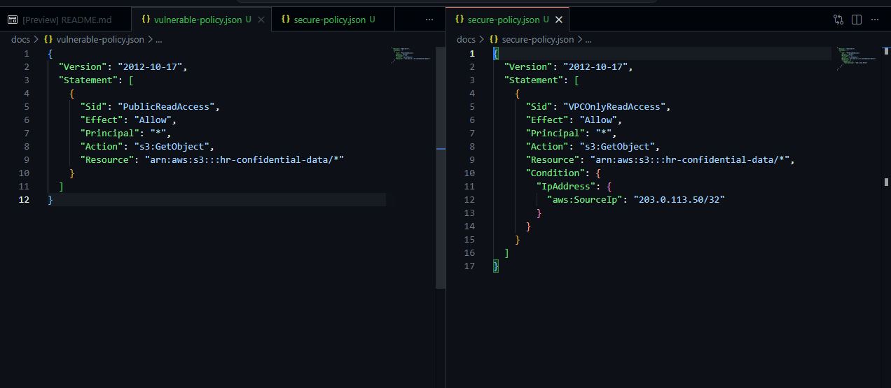

### Summary
Conducted a cloud security audit on AWS Infrastructure as Code (IaC) to remediate a critically exposed S3 bucket.

### Environment
* **Platform:** GitHub Codespaces / AWS IAM Policy Simulator
* **Concepts:** Cloud Security, Infrastructure as Code (IaC), JSON, AWS S3, Identity and Access Management (IAM), Data Loss Prevention (DLP).

### Diagnostic / Execution Steps
1. Audited a vulnerable JSON policy attached to an HR data S3 bucket that improperly utilized a wildcard (`*`) principal, exposing confidential data to the public internet.
2. Analyzed the business requirement to restrict data access exclusively to corporate network traffic.
3. Authored a remediated JSON policy implementing a `Condition` block.
4. Enforced strict IP-based access control, limiting `s3:GetObject` actions to the corporate VPN's static IP address (`203.0.113.50/32`).

### Evidence

### Lessons Learned
Misconfigured cloud storage is a leading cause of enterprise data breaches. Implementing least-privilege access via strict JSON policy conditions is critical for securing cloud-native infrastructure.
